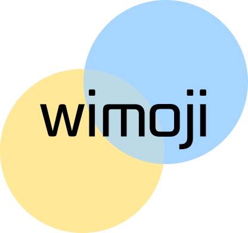

# Readme

# wimoji

### 🎞 기획 의도

- 혼자서 무언가 하기 어려울 때! 주변 사람들과 같이 활동하고 싶을 때 사용하세요.

### 💡 서비스 특징

- 이모지를 통해 주변의 뜻이 맞는 사람들과 같이 즐거운 시간을 보낼 수 있어요!

### ✔ 주요 기능

- 로그인 후 주변에 생성된 이모지 카테고리 확인 가능
- 이모지를 클릭해 채팅 참여
- 이모지 생성/삭제
- 마이페이지에서 이모지 및 채팅방 확인/관리 가능

### 📅 프로젝트 진행 기간

2023.04.10일(월) ~ 2023.05.19(금)

## 💛 팀 소개

- **윤혜진**: 채팅 API, 리팩토링, 팀장
- **민동주**: Frontend, 회원 API
- **손유진**: Gateway, Test
- **이리나**: CI/CD, DevOps
- **이현정**: MSA, Git
- **함정빈**: CI/CD, 이모지API

## ⚙ 개발 환경

### 🖥️ Backend

- JVM : `OpenJDK 17`
- Spring Boot : `3.0.6`
- Gradle : `7.6`
- IDE : IntelliJ

### 🖥️ Frontend

- Vue : `2.6.14`
- Vuetify : `2.6.0`

### 💾 DB

- MongoDB : `4.4.20`

### 🔗 Server & DevOps

- Amazon EC2
- Nginx : `1.18.0`
- Docker : `23.0.4`
- Docker-Compose : `1.24.1`
- Jenkins : `2.375.3`

### 🎯 모니터링툴 & 테스팅툴

- SonarQube : `10.0.0.68432`
- Prometheus : `2.44.0`
- Grafana : `9.5.1`

### 👥 협업툴

- GitLab
- Jira
- Notion
- MatterMost

## 🗂 프로젝트 폴더 구조

- Frontend
    
    
- Backend
    
    

## 🗺 서비스 아키텍처

## 📜 기능 명세서

- API
    
    

## 🎨 기능 상세 설명

### 👉 회원가입

- 

## 📢 Notion

프로젝트 진행 과정에서 필요한 회의, 공지, 일정 등을 원페이지 협업 툴인 노션을 통해 관리했습니다.

또한 컨벤션 규칙, 브랜치 활용 규칙 등을 노션에 명시해두었고, 팀 미팅에 대한 피드백과 질문을 기록해 두어 언제든 확인할 수 있도록 관리하고 있습니다.

## 👨‍👩‍👧 Scrum

매일 아침 9시에 팀 단위로 전 날 했던 일, 오늘 할 일을 10분 정도 공유했습니다. 

유연한 분위기에서 스크럼을 통해서 개발에 집중할 수 있는 팀 분위기를 만들었습니다.

## 💭 회고록

### 📄 기획

- 주어진 기한 내에 소화 가능하도록 구체적 일정 수립하기
- 빠르고 구체적인 기획을 통해 충분한 개발 시간 마련하기

### 📢 소통을 잘하자

- api 명세, 변수 수정 혹은 merge 를 할 때 (프론트엔드 ↔ 백엔드 소통 중요)
- 서로 맡은 부분과 진행률을 파악하기 위해 협업 툴을 잘 이용하기

### 📝 기록을 잘하자

- 스크럼이나 회의 등의 기록을 꼼꼼히 하기
- 오늘 할 일, 오늘 한 일, 해야할 일 등등 매일 기록하기
- 공부하면서 얻은 지식을 정리해서 공유하기 → 팀원 간 동일한 고민 방지
- 트러블 슈팅을 제대로 관리해서 시간 단축하기

### 📋 명세를 잘하자

- 스토리보드 → 요구사항 명세 → 기능명세 → api 명세 등
- 전체적인 흐름을 파악하기 위한 명세 필수
