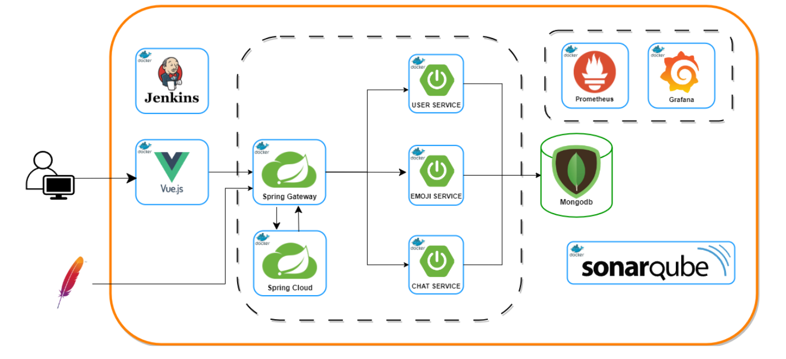
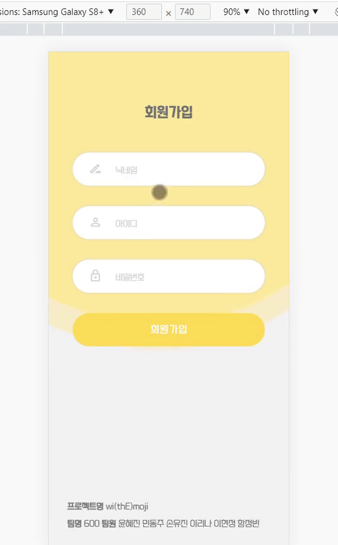
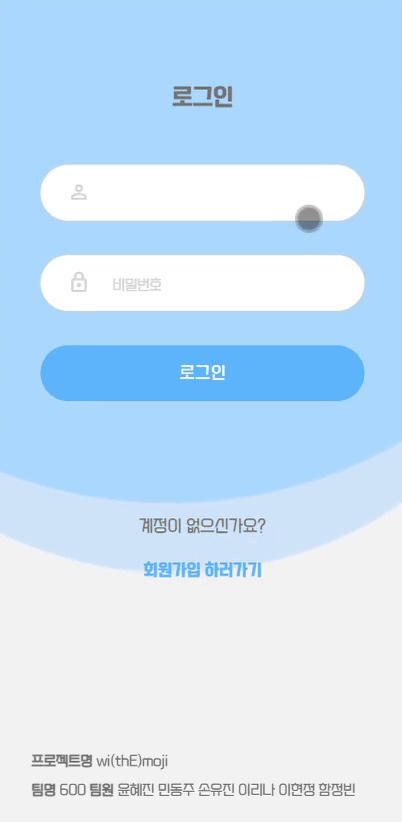
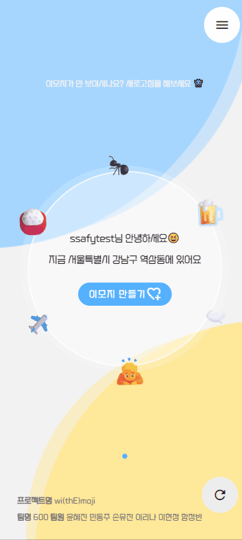
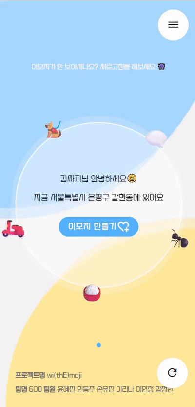
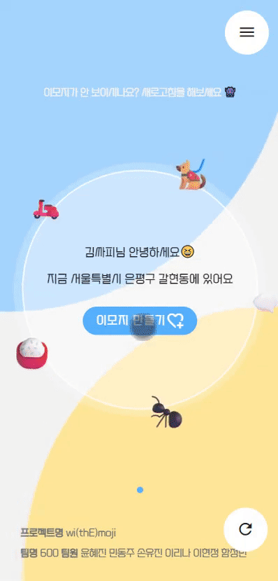
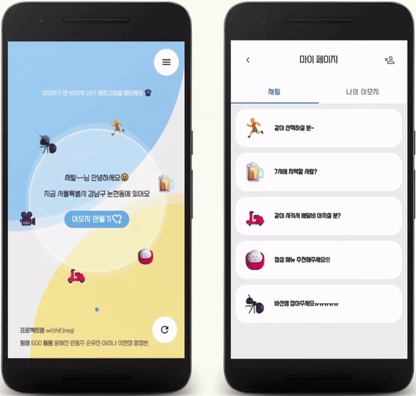

# 😀 이모지 중심의 위치 기반 실시간 채팅 서비스

# wimoji


### 🎞 기획 의도

- 혼자서 무언가 하기 어려울 때! 주변 사람들과 같이 활동하고 싶을 때 사용하세요.

### 💡 서비스 특징

- 이모지를 통해 주변의 뜻이 맞는 사람들과 같이 즐거운 시간을 보낼 수 있어요!

### ✔ 주요 기능

- 로그인 후 주변에 생성된 이모지 카테고리 확인 가능
- 이모지를 클릭해 채팅 참여
- 이모지 생성/삭제
- 마이페이지에서 이모지 및 채팅방 확인/관리 가능

### 📅 프로젝트 진행 기간

2023.04.10일(월) ~ 2023.05.19(금)

## 💛 팀 소개

- **윤혜진**: 채팅 API, 리팩토링, 팀장
- **민동주**: Frontend, 회원 API
- **손유진**: Gateway, Test
- **이리나**: CI/CD, DevOps
- **이현정**: MSA, Git
- **함정빈**: CI/CD, 이모지API

## ⚙ 개발 환경

### 🖥️ Backend

- JVM : `OpenJDK 17`
- Spring Boot : `3.0.6`
- Gradle : `7.6`
- IDE : IntelliJ

### 🖥️ Frontend

- Vue : `2.6.14`
- Vuetify : `2.6.0`

### 💾 DB

- MongoDB : `4.4.20`

### 🔗 Server & DevOps

- Amazon EC2
- Nginx : `1.18.0`
- Docker : `23.0.4`
- Docker-Compose : `1.24.1`
- Jenkins : `2.375.3`

### 🎯 모니터링툴 & 테스팅툴

- SonarQube : `10.0.0.68432`
- Prometheus : `2.44.0`
- Grafana : `9.5.1`

### 👥 협업툴

- GitLab
- Jira
- Notion
- MatterMost
    

## 🗺 서비스 아키텍처



## 🖨 문서

#### 📜 [기능 명세서](https://autumn-reptile-1d3.notion.site/a0a0401d32ad43f983bf2c4e76fd0793)

#### 🍎 [API 명세서](https://autumn-reptile-1d3.notion.site/API-d3e5f32ee9c241d78ee20f1de0144768)

#### 🎃 [와이어프레임](https://www.figma.com/embed?embed_host=notion&url=https%3A%2F%2Fwww.figma.com%2Ffile%2FKtkZx5sdU4GLHfgBxE5COw%2F10minite%3Fnode-id%3D0-1%26t%3DPkVoY2Xs37SOZHyq-0)

## 🎨 기능 상세 설명


### 👉 서비스 소개


- 로그인을 하지 않은 사용자가 접속했을때 보여지는 페이지
- wimoji 서비스 소개
- 지금 시작하기 버튼을 통해 로그인 이동

### 👉 회원가입 및 로그인

<div align="left" >
    
    
</div>

- 닉네임, 아이디, 비밀번호로 회원가입 진행
- 아이디, 비밀번호로 로그인 진행

### 👉 메인 화면

<div align="left">
    
    
    
</div>

- 현재 나의 위치 정보 표시
- 내 주변 로그인 한 사용자의 이모지를 거리가 가까운 순으로 30개 조회
- 이모지 클릭시 나타나는 함께하기 버튼으로 채팅 참여
- 이모지 만들기 버튼을 통해 이모지 생성
    - 15개의 이모지 카테고리, 내용, 인원수를 설정

### 👉 마이페이지

<div align="left">
    
    
</div>

- **채팅**
    - 사용자가 참여한 채팅 목록 조회
    - 새로운 메시지가 있을 시 new 표시
    - 새로운 채팅방 입장시 모든 사용자에게 입장 알림
    - 기존 채팅방 입장시 읽지 않은 메시지 조회
    - 채팅방 삭제 제공
- 이모지
    - 사용자가 생성한 이모지 조회, 삭제 제공

## 📢 Notion

프로젝트 진행 과정에서 필요한 회의, 공지, 일정 등을 원페이지 협업 툴인 노션을 통해 관리했습니다.

또한 컨벤션 규칙, 브랜치 활용 규칙 등을 노션에 명시해두었고, 팀 미팅에 대한 피드백과 질문을 기록해 두어 언제든 확인할 수 있도록 관리하고 있습니다.

## 👨‍👩‍👧 Scrum

매일 아침 9시에 팀 단위로 전 날 했던 일, 오늘 할 일을 10분 정도 공유했습니다. 

유연한 분위기에서 스크럼을 통해서 개발에 집중할 수 있는 팀 분위기를 만들었습니다.

## 💭 회고록

### 📄 기획

- 주어진 기한 내에 소화 가능하도록 구체적 일정 수립하기
- 빠르고 구체적인 기획을 통해 충분한 개발 시간 마련하기

### 📢 소통을 잘하자

- api 명세, 변수 수정 혹은 merge 를 할 때 (프론트엔드 ↔ 백엔드 소통 중요)
- 서로 맡은 부분과 진행률을 파악하기 위해 협업 툴을 잘 이용하기

### 📝 기록을 잘하자

- 스크럼이나 회의 등의 기록을 꼼꼼히 하기
- 오늘 할 일, 오늘 한 일, 해야할 일 등등 매일 기록하기
- 공부하면서 얻은 지식을 정리해서 공유하기 → 팀원 간 동일한 고민 방지
- 트러블 슈팅을 제대로 관리해서 시간 단축하기

### 📋 명세를 잘하자

- 스토리보드 → 요구사항 명세 → 기능명세 → api 명세 등
- 전체적인 흐름을 파악하기 위한 명세 필수

## 🗂 프로젝트 폴더 구조

- Frontend
```
frontend
├─ .gitignore
├─ babel.config.js
├─ Dockerfile
├─ jsconfig.json
├─ nginx.conf
├─ package-lock.json
├─ package.json
├─ public
│  ├─ favicon.ico
│  └─ index.html
├─ README.md
├─ src
│  ├─ api
│  │  ├─ index.js
│  │  └─ modules
│  │     ├─ chat.js
│  │     ├─ emoji.js
│  │     ├─ location.js
│  │     ├─ user.js
│  │     └─ websocket.js
│  ├─ App.vue
│  ├─ assets
│  │  ├─ logo.png
│  │  └─ styles
│  │     ├─ font.css
│  │     ├─ globalEtc.css
│  │     ├─ override.css
│  │     ├─ text.css
│  │     └─ variable.css
│  ├─ common
│  │  └─ component
│  │     ├─ BlueCircle.vue
│  │     ├─ WhiteCircle.vue
│  │     └─ YellowCircle.vue
│  ├─ components
│  │  ├─ ChatPage
│  │  │  ├─ ChatPage.vue
│  │  │  └─ ChattingPage.vue
│  │  ├─ EmojiList
│  │  │  └─ EmojiList.vue
│  │  ├─ ErrorPage
│  │  │  └─ The404Error.vue
│  │  ├─ HomePage
│  │  │  ├─ HomeEmoji.vue
│  │  │  ├─ HomePage.vue
│  │  │  ├─ HomePageCreateEmoji.vue
│  │  │  └─ HomeWhiteCircle.vue
│  │  ├─ InfoPage
│  │  │  ├─ InfoItem.vue
│  │  │  └─ InfoPage.vue
│  │  ├─ MyEmojiPage
│  │  │  ├─ MyEmojiDetail.vue
│  │  │  ├─ MyEmojiList.vue
│  │  │  └─ MyEmojiPage.vue
│  │  └─ SignPage
│  │     ├─ LoginInput.vue
│  │     ├─ LoginPage.vue
│  │     ├─ SignupInput.vue
│  │     └─ SignupPage.vue
│  ├─ main.js
│  ├─ plugins
│  │  └─ vuetify.js
│  ├─ router
│  │  ├─ index.js
│  │  └─ modules
│  │     ├─ error.js
│  │     ├─ main.js
│  │     ├─ my.js
│  │     └─ sign.js
│  ├─ store
│  │  ├─ index.js
│  │  └─ modules
│  │     ├─ chatStore.js
│  │     ├─ emojiStore.js
│  │     └─ userStore.js
│  └─ views
│     ├─ Headers
│     │  ├─ ChatRoomHeader.vue
│     │  ├─ HomeHeader.vue
│     │  └─ MyHeader.vue
│     ├─ HeaderView.vue
│     ├─ MainView.vue
│     ├─ MyPageView.vue
│     └─ TheFooter.vue
└─ vue.config.js

```
    
- Backend


```
springboot-framework
├─ chat-service
│  ├─ build.gradle
│  ├─ Dockerfile
│  ├─ gradlew
│  ├─ gradlew.bat
│  ├─ settings.gradle
│  └─ src
│     └─ main
│        └─ java
│           └─ com
│              └─ wimoji
│                 ├─ base
│                 │  ├─ constant
│                 │  │  └─ Code.java
│                 │  ├─ dto
│                 │  │  ├─ DataResponseDto.java
│                 │  │  ├─ ErrorResponseDto.java
│                 │  │  └─ ResponseDto.java
│                 │  └─ GeneralException.java
│                 ├─ config
│                 │  ├─ ExceptionHandler.java
│                 │  ├─ MongoDBConfig.java
│                 │  ├─ WebConfig.java
│                 │  └─ WebSocketConfig.java
│                 ├─ controller
│                 │  ├─ ChatController.java
│                 │  ├─ ChatRoomController.java
│                 │  └─ TestController.java
│                 ├─ intercepter
│                 │  ├─ LogAspect.java
│                 │  └─ SubscriptionInterceptor.java
│                 ├─ repository
│                 │  ├─ ChatRoomRepository.java
│                 │  ├─ dto
│                 │  │  ├─ entity
│                 │  │  │  ├─ Chat.java
│                 │  │  │  ├─ ChatRoom.java
│                 │  │  │  ├─ LastChat.java
│                 │  │  │  ├─ LastChatId.java
│                 │  │  │  └─ Test.java
│                 │  │  ├─ request
│                 │  │  │  ├─ ChatReq.java
│                 │  │  │  ├─ ChatRoomReq.java
│                 │  │  │  ├─ NewChatReq.java
│                 │  │  │  └─ UserChatRoomReq.java
│                 │  │  └─ response
│                 │  │     ├─ ChatRes.java
│                 │  │     ├─ ChatRoomRes.java
│                 │  │     ├─ NumberRes.java
│                 │  │     ├─ UserEnterRes.java
│                 │  │     └─ UserRes.java
│                 │  ├─ LastChatRepository.java
│                 │  └─ TestRepository.java
│                 ├─ service
│                 │  ├─ ChatRoomService.java
│                 │  ├─ TestService.java
│                 │  └─ UserServiceClient.java
│                 └─ WimojiApplication.java
├─ emoji-service
│  ├─ build.gradle
│  ├─ Dockerfile
│  ├─ gradle
│  ├─ gradlew
│  ├─ gradlew.bat
│  ├─ settings.gradle
│  └─ src
│     └─ main
│        └─ java
│           └─ com
│              └─ wimoji
│                 ├─ base
│                 │  ├─ constant
│                 │  │  └─ Code.java
│                 │  ├─ dto
│                 │  │  ├─ DataResponseDto.java
│                 │  │  ├─ ErrorResponseDto.java
│                 │  │  └─ ResponseDto.java
│                 │  └─ GeneralException.java
│                 ├─ config
│                 │  ├─ ExceptionHandler.java
│                 │  ├─ KafkaConfig.java
│                 │  ├─ MongoDBConfig.java
│                 │  └─ WebConfig.java
│                 ├─ controller
│                 │  ├─ EmojiController.java
│                 │  ├─ HomeController.java
│                 │  └─ TestController.java
│                 ├─ intercepter
│                 │  └─ LogAspect.java
│                 ├─ repository
│                 │  ├─ dto
│                 │  │  ├─ request
│                 │  │  │  ├─ EmojiDeleteReq.java
│                 │  │  │  ├─ EmojiModifyReq.java
│                 │  │  │  ├─ EmojiSaveReq.java
│                 │  │  │  └─ HomeReq.java
│                 │  │  ├─ response
│                 │  │  │  ├─ EmojiGetRes.java
│                 │  │  │  ├─ HomeRes.java
│                 │  │  │  ├─ NumberRes.java
│                 │  │  │  └─ UserRes.java
│                 │  │  └─ Test.java
│                 │  ├─ Entity
│                 │  │  ├─ Emoji.java
│                 │  │  └─ User.java
│                 │  ├─ TestRepository.java
│                 │  └─ UserRepository.java
│                 ├─ service
│                 │  ├─ ChatServiceClient.java
│                 │  ├─ EmojiService.java
│                 │  ├─ HomeService.java
│                 │  ├─ TestService.java
│                 │  └─ UserServiceClient.java
│                 └─ WimojiApplication.java
├─ gateway-service
│  ├─ build.gradle
│  ├─ Dockerfile
│  ├─ gradlew
│  ├─ gradlew.bat
│  ├─ settings.gradle
│  └─ src
│     └─ main
│        ├─ java
│        │  └─ com
│        │     └─ wimoji
│        │        └─ gatewayservice
│        │           ├─ config
│        │           │  └─ FilterConfig.java
│        │           ├─ filter
│        │           │  ├─ CustomFilter.java
│        │           │  ├─ GlobalFilter.java
│        │           │  └─ LoggingFilter.java
│        │           └─ GatewayServiceApplication.java
│        └─ resources
│           └─ logback.xml
├─ README.md
├─ spring-cloud
│  ├─ build.gradle
│  ├─ Dockerfile
│  ├─ settings.gradle
│  └─ src
│     └─ main
│        └─ java
│           └─ com
│              └─ wimoji
│                 └─ WimojiApplication.java
└─ user-service
   ├─ build.gradle
   ├─ Dockerfile
   ├─ gradlew
   ├─ gradlew.bat
   ├─ settings.gradle
   └─ src
      └─ main
         └─ java
            └─ com
               └─ wimoji
                  ├─ base
                  │  ├─ constant
                  │  │  └─ Code.java
                  │  ├─ dto
                  │  │  ├─ DataResponseDto.java
                  │  │  ├─ ErrorResponseDto.java
                  │  │  └─ ResponseDto.java
                  │  └─ GeneralException.java
                  ├─ common
                  │  └─ JwtTokenUtil.java
                  ├─ config
                  │  ├─ ExceptionHandler.java
                  │  ├─ KafkaConfig.java
                  │  ├─ MongoDBConfig.java
                  │  └─ WebConfig.java
                  ├─ controller
                  │  ├─ TestController.java
                  │  └─ UserController.java
                  ├─ intercepter
                  │  └─ LogAspect.java
                  ├─ repository
                  │  ├─ dto
                  │  │  ├─ Emoji.java
                  │  │  ├─ request
                  │  │  │  ├─ UserChatRoomReq.java
                  │  │  │  └─ UserReq.java
                  │  │  ├─ response
                  │  │  │  ├─ ChatRoomRes.java
                  │  │  │  └─ NumberRes.java
                  │  │  ├─ Test.java
                  │  │  └─ UserEntity.java
                  │  ├─ TestRepository.java
                  │  └─ UserRepository.java
                  ├─ service
                  │  ├─ ChatServiceClient.java
                  │  ├─ TestService.java
                  │  └─ UserService.java
                  └─ WimojiApplication.java

```
